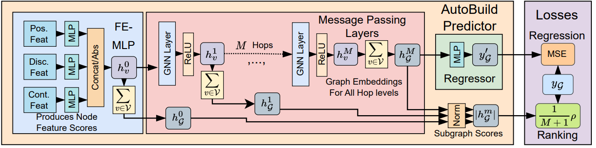

# Building Optimal Neural Architectures using Interpretable Knowledge

<p align="center">
    <a href="https://nips.cc/" alt="Conference">
        </a>
    <a href="https://github.com/Ascend-Research/AIO-P/blob/master/LICENSE" alt="License">
        </a>
    <a href="https://www.python.org/" alt="Python">
        </a>
    <a href="https://pytorch.org/" alt="PyTorch">
        </a>
<p/>

Repository for the paper
> [Building Optimal Neural Architectures using Interpretable Knowledge](https://kgmills.github.io/assets/papers/AutoBuild_CVPR24.pdf)) \
> Keith G. Mills, Fred X. Han, Mohammad Salameh, Shengyao Lu, Chunhua Zhou, Jiao He, Fengyu Sun, Di Niu \
> CVPR 2024

[[Poster](https://kgmills.github.io/assets/posters/AutoBuild_CVPR24_poster.pdf)][[Video](https://www.youtube.com/watch?v=rujgUNaXKr4&ab_channel=KeithMills)][[Slides](https://kgmills.github.io/assets/slides/AutoBuild_CVPR24_slides.pdf)]

<p align="center">
  
</p>

*Above: High-level illustration of AutoBuild. A Feature Embedding Multi-Layer Perceptron 
(FE-MLP) first processes different categories of node features using separate MLPs, before concatening the resultant scalars and taking their absolute values. The node embeddings are then passed to several message passing layers. Graph embeddings from every hop-level are used in the ranking loss.*

### Supported Functionality
Currently, this repository provides access to the OFA experiments which can be run on a single 
consumer-grade GPU.

### Dependencies and Virtual Environment
We built our conda virtual environment using the following commands:

```
$ conda create -n "autobuild" python=3.10
$ conda activate autobuild
$ conda install pytorch==2.1.2 torchvision==0.16.2 torchaudio==2.1.2 pytorch-cuda=11.8 -c pytorch -c nvidia
$ pip install ~/torchsort-0.1.9+pt21cu118-cp310-cp310-linux_x86_64.whl  (Downloaded from https://github.com/teddykoker/torchsort/releases/tag/v0.1.9)
$ conda install pyg -c pyg
$ conda install -c conda-forge onnx
$ conda install networkx
$ pip install ofa gdown pyyaml thop
```

### Architecture Graph Datasets
Get the data from this [Google Drive link](https://drive.google.com/drive/folders/1Ku2KmpU1edTZH8su9zCEaT6LiajjUlAg?usp=sharing) and place the contents in `/cache/`

* `ofa_mbv3_custom_cache.pkl` and `ofa_pn_custom_cache.pkl` each contain our 3k architecture sets, respectively. These use the sequence graph format and are annoted with accuracy and latency on the GPU, CPU and NPU.
* `ofa_mbv3_pan_seg_custom_cache.pkl` and `ofa_pn_pan_seg_custom_cache.pkl` are trimmed-down versions of the `pseudo-labeled` architecture caches provided by AIO-P in sequence graph format.
* `ofa_mbv3_pn_onnx_ir_cache.pkl` contains the 3k MBv3 and 3k PN architectures in our rich custom ONNX IR format. 

### Training an AutoBuild Predictor
The main file is `train_predictor.py`, an example command would be:
```
$ python train_predictor.py -families ofa_mbv3 -target 'acc' -format custom -epochs_predictor 200 -tag code_demo -plots
```
#### Important flags:
* `-families`/`-format` is how you specify graph dataset you want to train on and graph representation, specifically. `custom` is for sequence graphs while `onnx_ir` uses the more rich format. `onnx_ir` is only applicable when `-families` is set to `pn_mbv3`. Specifically, code will open our `/cache/{families}_{format}_cache.pkl` as the predictor dataset.
* `-target` specifies the predictor target. Default is `acc` but can be changed to specify an equation that combines 
  multiple metrics. Specifically, `acc` refers to ImageNet top-1, `latency_gpu`, `latency_cpu` and `latency_npu` 
  refer to latency on different hardware devices. Specifying `-acc '(acc*100)/latency_gpu` will have the predictor 
  learn on the quotient of these 2 metrics; note that `acc*100` is used because the accuracy metrics are in decimal 
  format (e.g., 0.7564) while latency is in ms (e.g., 11.20). You can even use `numpy` 
  functions, e.g., `-acc np.
  power
  (100, 
  acc)/(np.log10(latency_gpu+1)+1)`. For Panoptic Segmentation caches, performance key is `pan_seg_PQ` and FLOPs are `flops_pan_seg`.
* `-corr_lambda` controls whether the SRCC loss on embeddings is used. Default is 1.
* `-epochs_predictor` is epochs: 200 for Classification networks, 300 for Panoptic Segmentation.
* `-tag` will prepend model checkpoints and other related files, e.g., plots, with whatever string you enter.
* `-plots` will save some images to `/plots/` following predictor training, but requires that graphviz be installed. More details below.

Executing the script will cause a lot of information to print to the screen. We suggest piping the output to a `.txt` file if you want to see it later. Specifically, the script will print the following:

1. Some information on the random seed selected, as well as location of the data to be loaded.
2. Specifying computation of predictor target.
3. [if `-format` is `custom`] Tensors describing the distribution of targets by units `u` and layers `l` in the data.
4. Training data target distribution, that this will be normalized to `N(0, 1)`.
5. Predictor trains for `-epochs_predictor` iterations
6. Test statistics, e.g., SRCC, MAE, MPE.
7. Read-out from the FE-MLP on 0-hop node feature importance.
8. Hop moments,
9. Confirmation that predictor checkpoint has been saved to disk.

`train_predictor.py` will save several files to disk. These files will have a common name that is a combination of arguments to the script. The saved files are:

* The predictor checkpoint at `/saved_models/`, e,g., `code_demo_ofa_mbv3_custom_acc_GATv2Conv_mean_directed_srcc1_predictor.pt`
* Arguments passed to `train_predictor.py` at `/configs/`, e.g., `code_demo_ofa_mbv3_custom_acc_GATv2Conv_mean_directed_srcc1_config.pkl`; this is important, do not delete it.
* If `-plots` was specified, several PNG images will be saved to `/plots/`, e.g., `code_demo_ofa_mbv3_custom_acc_GATv2Conv_mean_directed_srcc1_layer_0.png`. Each plot is an illustration of the architecture that MAXIMIZES whatever target was specified with `-acc`. The nodes are color coded according to their embedding norms, e.g., green is a low (not important) embedding norm, orange is a high (important) embedding norm. The `layer_X` suffix denotes the GNN message passing layer the embedding norms were taken from, so `layer_0.png` is for the 0-Hop FE-MLP, `layer_3.png` is for the 3-hop (4-node) layer.


### Ranking Subgraphs
In order to generate a reduced search space that we can either exhaustively evaluate or pair with another NAS algorithm, we need to rank all architecture module subgraphs. This is done using `label_units.py`:
```
$ python label_units.py -chkpt <PREDICTOR CHECKPOINT PT FILE>
```
E.g., `python label_units.py -chkpt saved_models/code_demo_ofa_mbv3_custom_acc_GATv2Conv_mean_directed_srcc1_predictor.pt`
This will save a file in `/units/` with the suffix `labeled_sgs.pkl`. We need this file for later.

### Exhaustive Evaluation of a Small Search Space
```
$ python eval_topk_ofa.py -unit_corpus units/<LABELED_SGS.PKL FILE> -k <K> -m <METRIC>
```
* NOTE: You will need to edit line 26 of `iterators/ofa_manager.py` to point to your ImageNet directory, as well as adjust batch size and number of workers.
* `-m` is the metric you want to evaluate - `acc`, `gpu` or `cpu`. Acc will use the OFA repo to gauge the top-1 performance on ImageNet for each architecture in the reduced search space. `gpu` and `cpu` will measure latency on your hardware. We also provide 3 latency predictors in `/l1_models/` for MBv3/PN each that will append an estimate of 2080 Ti, 2990WX or Kirin 9000 latency to your model. 
* `-K` should be sufficiently small.

This script will constantly save a `.pkl` and `.lock` file in `/evals/`, containing the architecture configurations and recorded metrics. You can open the `.pkl` file it with ipython to take a look.

### NAS with Reduced Search Space
First step is to generate a file for the reduced search space:
```
$ python save_topk_ofa.py -unit_corpus units/<LABELED_SGS.PKL FILE> -k <K>
```
Will save a file with suffix `search_space.pkl` under `/evals/`. Filename will include your value of `-k`.


Second step is to setup the repo. We provide the code changes you will need.

1. Clone the Block Profiling repo: https://github.com/Ascend-Research/BlockProfile/ (commit 7ebe9a0)
2. Copy the contents of `/rm_search/` to `BlockProfile/search/rm_search/` to overwrite their code.
3. In `rm_search/constants.py`, change the global variable `DIR_TO_APPEND` to point to this repo.
4. Create a symbolic link between the `/l1_models/` directory of *this* repo and the top-level of `/BlockProfile/` 
5. You can now run the evolutonary search code using `run_ofa_mbv3_unit_pareto_search.py` and `run_ofa_pn_unit_pareto_search.py` from the BlockProfile repo. Sample command:

```
$ export PYTHONPATH=/BlockProfile/Dir/Location && CUDA_VISIBLE_DEVICES=0 python -u search/rm_search/run_ofa_mbv3_unit_pareto_search.py 
-batch_size 200 # This can be changed
-model_name code_demo_mbv3_npu
-resolution 224 
-metric Kirin9000_predicted # Or 2080Ti_predicted, or 2990WX_predicted
-imagenet_data_dir /your/imagenet/dir
-unit_corpus <Optional; one or more `search_space.pkl` files.> 
```

The command without any comments (you still need to file in export dir, imagenet, etc.)
```
$ export PYTHONPATH=/BlockProfile/Dir/Location && CUDA_VISIBLE_DEVICES=0 python -u search/rm_search/run_ofa_mbv3_unit_pareto_search.py -batch_size 200 -model_name code_demo_mbv3_npu -resolution 224 -metric Kirin9000_predicted -imagenet_data_dir /your/imagenet/dir -unit_corpus 
```
Running with `-unit_corpus` unset will run `Stage-Full` from the paper, so no reduced search space. 

To run the original BlockProfiling with layer-wise mutation, please see the instuctions in their repository (`/BlockProfile/search/rm_search/README.md`). Just note that we have modified their Pareto frontier code to work with our latency predictor, so you will have to specify `-metric` for `run_ofa_mbv3_rm_pareto_search.py` as well.

**Note**: The default parameters of all search scripts have been adjusted to match our experimental settings (50 initial random archs + 4 iterations of 50 additional archs for a total of 250).

### Bibtex 
If you find our framework useful, we kindly ask that you cite our paper:
```
@inproceedings{mills2024autobuild,
    author    = {Mills, Keith G. and Fred, X. Han and Salameh, Mohammad and Lu, Shengyao and Zhou, Chunhua and He, Jiao and Sun, Fengyu and Niu, Di},
    title     = {Building Optimal Neural Architectures using Interpretable Knowledge},
    booktitle = {Proceedings of the IEEE/CVF Conference on Computer Vision and Pattern Recognition (CVPR)},
    month     = {June},
    year      = {2024},
}
```
